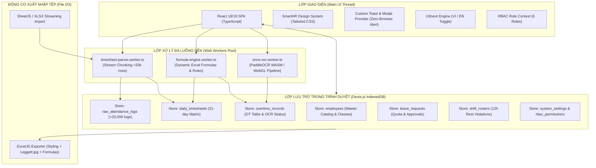
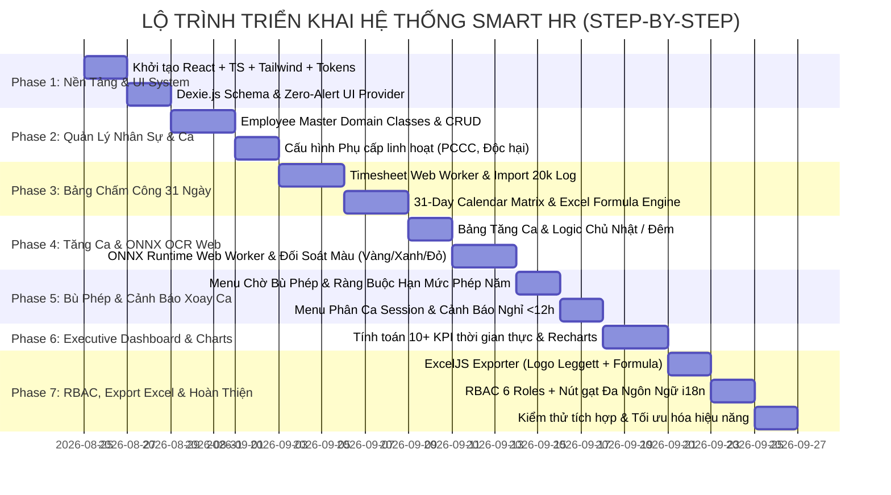

# KẾ HOẠCH TỔNG THỂ & THIẾT KẾ HỆ THỐNG (PLAN.MD)
## SMART HR - HỆ THỐNG QUẢN TRỊ NHÂN SỰ & CHẤM CÔNG DOANH NGHIỆP
### Kiến trúc: Single-File In-Browser Backend (React + TypeScript + Web Worker + Dexie.js + ONNX Web)
**Tổ chức Doanh nghiệp**: Leggett & Platt / SmartHR System  
**Ngày cập nhật**: 24/08/2026  
**Trạng thái**: Bản Kế Hoạch Đặc Tả Kỹ Thuật Chi Tiết (Approved Draft)

---

## MỤC LỤC
1. [Phân Tích UX/UI & Design System từ SmartHR Figma Kit & Mẫu Thực Tế](#1-phân-tích-uxui--design-system)
2. [Kiến Trúc Kỹ Thuật "Single-File In-Browser Backend"](#2-kiến-trúc-kỹ-thuật-single-file-in-browser-backend)
3. [Đặc Tả Chi Tiết 7 Phân Hệ Chức Năng (Modules Breakdown)](#3-đặc-tả-chi-tiết-7-phân-hệ-chức-năng)
   - 3.1. Dashboard Báo Cáo & Phân Tích Nhân Sự Toàn Diện
   - 3.2. Menu Tổng Nhân Viên (Employee Master Catalog & Domain Classes)
   - 3.3. Menu Bảng Chấm Công 31 Ngày (Timesheet Calendar Matrix)
   - 3.4. Menu Quản Lý Tăng Ca (Overtime Tracking & OCR Verification)
   - 3.5. Menu Danh Sách Chờ Bù Phép & Quản Trị Hạn Mức Phép
   - 3.6. Menu Phân Ca & Cảnh Báo Vi Phạm Xoay Ca (< 12 Tiếng)
   - 3.7. Menu OCR Đối Soát Phiếu Tăng Ca Tự Động (PaddleOCR ONNX Web)
4. [Hệ Thống Phân Quyền (RBAC) & Đa Ngôn Ngữ (i18n) & Cài Đặt](#4-hệ-thống-phân-quyền-rbac--đa-ngôn-ngữ-i18n)
5. [Đặc Tả Động Cơ Import & Export Excel Chuẩn Doanh Nghiệp](#5-đặc-tả-động-cơ-import--export-excel)
6. [Hệ Thống UI Notification & Dialogue (Zero Browser Alert Policy)](#6-hệ-thống-ui-notification--dialogue)
7. [Kế Hoạch Triển Khai Step-by-Step (Implementation Roadmap)](#7-kế-hoạch-triển-khai-step-by-step)
8. [Bộ Nhớ Trạng Thái Phiên Làm Việc (`state.json`) & Persona (`agent.md`)](#8-bộ-nhớ-trạng-thái-statejson--agentmd)
9. [Bộ Câu Hỏi Làm Rõ Các Điểm Nghiệp Vụ Chưa Rõ Ràng](#9-bộ-câu-hỏi-làm-rõ)

---

## 1. PHÂN TÍCH UX/UI & DESIGN SYSTEM
Dựa trên việc bóc tách trực tiếp tệp thiết kế `SmartHR - Free Figma UI Kit for HRM & Employee Management (Community).fig`, ảnh thực tế `image.png` và tài liệu chốt công `KIỂM TRA CHÔT CÔNG THÁNG 08.2026.xlsx`:

### 1.1. Typography Hierarchy
- **Font Family**: Hệ thống sử dụng `'Plus Jakarta Sans'`, `'Inter'`, `-apple-system`, `BlinkMacSystemFont`, `'Segoe UI'`, `Roboto`, `sans-serif`. Hỗ trợ toàn diện bộ ký tự tiếng Việt Unicode dựng sẵn và tiếng Anh.
- **Thang đo cỡ chữ & Độ đậm (Typographic Scale)**:
  - **Display / KPI Metrics**: `32px` | `font-bold (700)` | Line-height: `1.2`
  - **H1 (Page Title)**: `24px` | `font-semibold (600)` | Line-height: `1.3`
  - **H2 (Card Header / Dialog Title)**: `18px` - `20px` | `font-semibold (600)` | Line-height: `1.4`
  - **H3 (Sub-section / Filter Title)**: `15px` - `16px` | `font-medium (500)` | Line-height: `1.4`
  - **Body 1 (Table Data, Form Inputs, Dropdowns)**: `14px` | `font-normal (400)` / `font-medium (500)` | Line-height: `1.5`
  - **Body 2 (Metadata, Tooltips, Sub-labels)**: `13px` | `font-normal (400)` | Line-height: `1.4`
  - **Badges / Status Pills / Calendar Headers**: `11px` - `12px` | `font-semibold (600)` | Letter-spacing: `0.02em`

### 1.2. Bảng Màu Thiết Kế (Color Palette & Semantic Tokens)
- **Màu thương hiệu (Brand Colors)**:
  - `Primary Coral Gradient`: Linear gradient từ `#FF902F` sang `#FC6075` (Biểu tượng nhận diện của SmartHR).
  - `Corporate Navy`: `#002D62` (Màu xanh thương hiệu Leggett & Platt trên logo `Leggett.jpg`).
  - `Sidebar / Topbar Dark`: `#1E293B` (Slate-800) / `#0F172A` (Slate-900).
  - `Body Background`: `#F8FAFC` (Slate-50) tạo độ tương phản dịu mắt, tránh mỏi mắt khi làm việc với bảng tính lớn.
  - `Surface Cards`: `#FFFFFF` viền nhẹ `#E2E8F0` (Slate-200), đổ bóng mềm `box-shadow: 0 1px 3px 0 rgb(0 0 0 / 0.05)`.
- **Mã màu Trạng thái Chấm công (Attendance Badge Colors - Đối chiếu `image.png` & Excel)**:
  | Ký hiệu | Ý nghĩa | Màu chữ (Text) | Màu nền (Background) | Viền (Border) |
  | :--- | :--- | :--- | :--- | :--- |
  | **W** | Đi làm đầy đủ đúng giờ | `#065F46` (Emerald-800) | `#D1FAE5` (Emerald-100) | `#A7F3D0` |
  | **N** | Đi ca đêm (Night Shift) | `#3730A3` (Indigo-800) | `#E0E7FF` (Indigo-100) | `#C7D2FE` |
  | **Off** | Không chấm vào & ra (Chờ bù phép) | `#991B1B` (Red-800) | `#FEE2E2` (Red-100) | `#FECACA` |
  | **WO** | Ngày nghỉ hàng tuần (T7/CN) | `#5B21B6` (Purple-800) | `#EDE9FE` (Purple-100) | `#DDD6FE` |
  | **AL** | Nghỉ phép năm (Annual Leave) | `#1E40AF` (Blue-800) | `#DBEAFE` (Blue-100) | `#BFDBFE` |
  | **UL** | Nghỉ không lương (Unpaid Leave) | `#475569` (Slate-600) | `#F1F5F9` (Slate-100) | `#E2E8F0` |
  | **SL** | Nghỉ ốm / bệnh (Sick Leave) | `#9D174D` (Pink-800) | `#FCE7F3` (Pink-100) | `#FBCFE8` |
  | **PL** | Nghỉ chế độ (Tang, cưới có lương) | `#065F46` (Teal-800) | `#CCFBF1` (Teal-100) | `#99F6E4` |
  | **PH** | Nghỉ lễ theo luật (Public Holiday) | `#D97706` (Amber-600) | `#FEF3C7` (Amber-100) | `#FDE68A` |
  | **BT** | Đi công tác (Business Trip) | `#075985` (Sky-800) | `#E0F2FE` (Sky-100) | `#BAE6FD` |
  | **W/2 AL/2** | Nửa ngày làm việc, nửa ngày phép | `#1E40AF` | Gradient `#D1FAE5` / `#DBEAFE` | `#BFDBFE` |
- **Mã màu Trạng thái Xác thực Tăng ca (Overtime Status Colors)**:
  - **Vàng nhạt (Chờ đối soát / Pending)**: Nền `#FEF3C7`, Chữ `#92400E`, Viền `#FDE68A`.
  - **Xanh lá (Đã khớp OCR / Verified)**: Nền `#D1FAE5`, Chữ `#065F46`, Viền `#A7F3D0`.
  - **Đỏ nhạt (Lệch dữ liệu OCR / Mismatch)**: Nền `#FEE2E2`, Chữ `#991B1B`, Viền `#FECACA`.
- **Mã màu Cảnh báo Vi phạm Xoay ca (< 12h Rest Violation)**:
  - Nền `#FEF2F2`, Chữ `#DC2626`, Icon nhấp nháy cảnh báo nguy cơ an toàn lao động.

### 1.3. Cấu Trúc Biểu Đồ (Data Visualizations & Charts)
- **Gauge / Semi-Donut Charts**: Đo lường tỷ lệ nghỉ việc (Turnover Rate), tỷ lệ đi trễ (Late Rate), tỷ lệ không chấm công (Missing Punch Rate).
- **Stacked Bar Charts**: Phân bổ tổng nhân sự theo phòng ban (Finance, Production, EHS, Sales, Logistics, WH, QC) chia theo loại hợp đồng (Chính thức vs Thời vụ).
- **Multi-Line & Area Trend Charts**: Thống kê biến động đi trễ, về sớm, vắng mặt theo từng ngày trong tháng.
- **KPI Widget Cards**: Thẻ số liệu chỉ số lớn kèm badge tăng giảm (+12% vs tháng trước, -3% vi phạm) và biểu tượng icon chuyên biệt.

---

## 2. KIẾN TRÚC KỸ THUẬT "SINGLE-FILE IN-BROWSER BACKEND"
Hệ thống được thiết kế theo triết lý **Zero-Server / Local-First**: Toàn bộ nghiệp vụ, cơ sở dữ liệu, động cơ tính toán và trí tuệ nhân tạo OCR hoạt động 100% trong môi trường trình duyệt người dùng.



### 2.1. Thiết Kế Cơ Sở Dữ Liệu Dexie.js (IndexedDB Schema)
```typescript
import Dexie, { Table } from 'dexie';

export interface IEmployee {
  employeeId: string;       // Khóa chính: LEP001, LEP010,...
  erpId?: string;           // Mã ERP: 1013789
  fullName: string;         // Họ và tên
  department: string;       // Finance, Production, WH, QC, Logistics, EHS, Sales...
  position: string;         // Chức danh công việc
  startDate: string;        // Ngày bắt đầu làm việc (DD/MM/YYYY)
  contractType: 'OFFICIAL' | 'SEASONAL'; // Chính thức (21-20) | Thời vụ (1-31)
  shiftClassId: 'OFFICE_M_F' | 'OFFICE_M_S' | 'SHIFT_1' | 'SHIFT_2';
  customAllowances: {
    pcccAllowance: number;      // Phụ cấp PCCC (chỉ cấp cho 3 NV bảo trì được chỉ định)
    hazardousAllowance: number; // Phụ cấp độc hại (chỉ cấp cho chuyền sơn / bộ phận chỉ định)
    diligenceBonus: number;     // Tiền chuyên cần
    productivityBonus: number;  // Thưởng năng suất
    tradeUnionFee: number;      // Trừ đoàn phí (mặc định -40,000 VND)
    otherFees: number;          // Chi phí khác
  };
  annualLeaveBalance: {
    initialQuota: number;       // Hạn mức phép năm đầu kỳ
    usedDays: number;           // Số ngày đã sử dụng
    remainingDays: number;      // Số ngày còn lại
  };
  status: 'ACTIVE' | 'RESIGNED' | 'MATERNITY';
  resignedDate?: string;
}

export interface IRawAttendanceLog {
  id?: number;              // Auto increment
  employeeId: string;       // Khóa ngoại liên kết LEPxxx
  fullName: string;         // Tên nhân viên
  departmentCode: string;   // Composite key vd LEP04046224
  date: string;             // YYYY-MM-DD
  dayOfWeek: string;        // Ba, Tư, Năm, Sáu, Bảy, CN, Hai
  checkIn: string;          // HH:mm
  checkOut: string;         // HH:mm
  lateMinutes: number;      // Số phút đi trễ
  earlyMinutes: number;     // Số phút về sớm
  workUnits: number;        // Công
  totalHours: number;       // Tổng giờ làm việc
  overtimeHours: number;    // Giờ tăng ca
  shiftName?: string;       // Ca làm việc
}

export interface IDailyTimesheetCell {
  employeeId_date: string;  // Khóa chính: LEP010_2026-07-21
  employeeId: string;
  date: string;
  dayIndex: number;         // 1 -> 31
  statusCode: string;       // 'W', 'N', 'Off', 'AL', 'UL', 'SL', 'PL', 'PH', 'BT', 'W/2 AL/2', etc.
  checkIn?: string;
  checkOut?: string;
  violations?: ('LATE' | 'EARLY' | 'MISSING_IN' | 'MISSING_OUT')[];
  calculatedOvertime: number;
  month: number;
  year: number;
}

export interface IOvertimeRecord {
  employeeId_date: string;  // Khóa chính: LEP010_2026-07-21
  employeeId: string;
  date: string;
  hours: number;
  dayType: 'WEEKDAY' | 'SUNDAY' | 'HOLIDAY';
  verificationStatus: 'PENDING' | 'MATCHED' | 'MISMATCH';
  ocrScanRefId?: string;
  verifiedBy?: string;
  verifiedAt?: string;
  month: number;
  year: number;
}
```

---

## 3. ĐẶC TẢ CHI TIẾT 7 PHÂN HỆ CHỨC NĂNG

### 3.1. Dashboard Báo Cáo & Phân Tích Nhân Sự Toàn Diện
Dashboard là trung tâm chỉ huy số liệu nhân sự trong tháng, tự động tính toán tức thì từ dữ liệu Dexie.js:
1. **Tổng số lượng nhân viên**:
   - Nhân viên thời vụ vs Nhân viên chính thức (Kèm biểu đồ tỷ lệ Stacked Donut).
2. **Báo cáo nhân viên theo ca**:
   - Tổng nhân viên đi Ca 1 (06:00 - 14:00) trong tháng.
   - Tổng nhân viên đi Ca 2 (14:00 - 22:00) trong tháng.
   - Tổng nhân viên đi Ca hành chính (Hành chính văn phòng T2-T6 & Hành chính chung T2-T7).
3. **Biến động nhân sự trong tháng**:
   - Tổng số nhân viên nghỉ việc trong tháng (`RESIGNED`).
   - Tổng số nhân viên nhận việc mới trong tháng (`Start Date` trong chu kỳ công).
   - Tỷ lệ nghỉ việc trong tháng (Turnover Rate % = $\frac{\text{Số NV nghỉ việc}}{\text{Tổng NV bình quân}} \times 100\%$).
4. **Phân bổ nhân sự theo phòng ban**:
   - Biểu đồ cột phân bổ nhân sự từng phòng ban: Finance, Production, Warehouse (WH), QC, Logistics, EHS, Sales, IT.
5. **Thống kê sai phạm chấm công theo phòng ban**:
   - Tổng số lượt nhân viên đi trễ theo từng phòng ban.
   - Tổng số lượt nhân viên về sớm theo từng phòng ban.
   - Tổng số lượt nhân viên không chấm công ra/vào chia theo phòng ban.
   - Tỷ lệ đi làm về trễ trong tháng (% Late).
   - Tỷ lệ không chấm công ra/vào trong tháng (% Missing Punch).
6. **Chỉ báo An Toàn Lao Động & Xoay Ca**:
   - **Tổng số nhân viên đổi ca nhưng chưa đáp ứng đủ 12 tiếng nghỉ ngơi** chia theo chi tiết từng phòng ban.
   - Có **Nút "Xem Chi Tiết"** để điều hướng trực tiếp sang **Menu Danh Sách Cần Lưu Ý** (Danh sách vi phạm xoay ca).

---

### 3.2. Menu Tổng Nhân Viên (Employee Master Catalog & Domain Classes)
Hệ thống xây dựng mô hình Class hướng đối tượng (`Employee`, `ShiftSchedule`, `AllowancePackage`) nhằm quản lý quan hệ chặt chẽ:
- **Định danh duy nhất**: Quản lý bằng mã số nhân viên định dạng `LEP000` / `LP000` làm khóa liên kết xuyên suốt toàn bộ các bảng tính và nhật ký quẹt thẻ.
- **Phân nhóm ca làm việc (Shift Classes)**:
  1. `OfficeAdmin_MonFri`: Đi làm từ Thứ 2 đến Thứ 6 (07:30 - 16:00). Công chuẩn tháng: 23 ngày. Thứ 7 và Chủ nhật mặc định để trống (nghỉ).
  2. `GeneralAdmin_MonSat`: Đi làm từ Thứ 2 đến Thứ 7 (07:30 - 16:00). Công chuẩn tháng: 27 ngày. Chủ nhật nghỉ.
  3. `Shift1_Morning`: 06:00 - 14:00 (Thứ 2 đến Thứ 7). Xoay ca linh hoạt.
  4. `Shift2_Evening`: 14:00 - 22:00 (Thứ 2 đến Thứ 7). Xoay ca linh hoạt.
- **Phân loại chu kỳ công theo loại hợp đồng**:
  - **Nhóm thời vụ (Seasonal)**: Chu kỳ tính công từ ngày **01 đến ngày 31** hàng tháng.
  - **Nhóm chính thức (Official)**: Chu kỳ tính công từ ngày **21 tháng trước đến ngày 20 tháng này** (vd: 21/07/2026 đến 20/08/2026).
- **Cơ chế phân bổ phụ cấp linh hoạt theo cá nhân**:
  - Cho phép tùy biến gắn phụ cấp trực tiếp vào từng mã nhân viên:
    * Ví dụ: Chỉ đúng 3 nhân viên kỹ thuật bảo trì được cấu hình nhận `Tiền trợ cấp PCCC`.
    * Chỉ các công nhân thuộc bộ phận Chuyền sơn được cấu hình nhận `Tiền độc hại`.
    * Cấu hình mức `Tiền chuyên cần` và `Thưởng năng suất`.
  - Mọi thay đổi về cấu hình phụ cấp lập tức đồng bộ thời gian thực sang bảng chốt công `KIỂM TRA CHÔT CÔNG THÁNG 08.2026.xlsx`.

---

### 3.3. Menu Bảng Chấm Công 31 Ngày (Timesheet Calendar Matrix)
Giao diện Calendar Matrix thiết kế hiện đại bám sát `image.png` và cấu trúc 58 cột của `KIỂM TRA CHÔT CÔNG THÁNG 08.2026.xlsx`:
- **Nguồn nạp dữ liệu**: Xử lý trực tiếp từ tệp thô máy chấm công `2107-20082026.xlsx` (>19,657 dòng).
- **Quy tắc Logic Chấm Công Tự Động**:
  - Đúng giờ theo ca quy định $\rightarrow$ Gán mã `W` (Nền xanh lá mềm).
  - Đi ca đêm $\rightarrow$ Gán mã `N` (Nền tím chàm).
  - Đi trễ hoặc về sớm hơn giờ quy định, hoặc chỉ quẹt 1 đầu (thiếu vào hoặc thiếu ra) $\rightarrow$ Ghi nhận thời gian thực tế, gắn cờ cảnh báo (sai phạm chấm công).
  - Trong ngày làm việc quy định mà **hoàn toàn không chấm công cả vào lẫn ra** $\rightarrow$ Tự động gán mã `Off` (Nền đỏ nhạt) và **tự động đẩy vào Menu Danh Sách Chờ Bù Phép**.
  - Ngày nghỉ hàng tuần của ca hành chính (Thứ 7 / CN đối với HC văn phòng) $\rightarrow$ Để trống hoặc gán `WO`.
- **Hệ Thống Động Cơ Công Thức Excel Tùy Biến (Formula Engine)**:
  Phía sau chuỗi 31 ngày lịch là hệ thống các cột tổng hợp công thức chuẩn xác 100% theo file mẫu:
  1. `Total Standard WD (Cột 40)`: Số ngày công chuẩn (23 hoặc 27).
  2. `Total WD (Cột 41)`: `=COUNTIF(I:AM,"W") + COUNTIF(I:AM,"W/2 AL/2")*0.5 + COUNTIF(I:AM,"BT") + COUNTIF(I:AM,"N") + COUNTIF(I:AM,"W/2 UL/2")*0.5`
  3. `Total AL (Cột 42)`: `=COUNTIF(I:AM,"AL") + COUNTIF(I:AM,"W/2 AL/2")*0.5 + COUNTIF(I:AM,"AL/2 UL/2")*0.5`
  4. `Total UL (Cột 43)`: `=COUNTIF(I:AM,"UL") + COUNTIF(I:AM,"W/2 UL/2")*0.5 + COUNTIF(I:AM,"AL/2 UL/2")*0.5`
  5. `Total PH (Cột 44)`: `=COUNTIF(I:AM,"PH")` (Nghỉ lễ)
  6. `Total SL (Cột 45)`: `=COUNTIF(I:AM,"SL")` (Nghỉ ốm)
  7. `Total PL (Cột 46)`: `=COUNTIF(I:AM,"PL")` (Nghỉ phép tang/cưới có lương)
  8. `Số ngày làm việc ban đêm (Cột 47)`: Đếm số ngày có mã `N`.
  9. `Early leaving going late (Cột 48)`: Tổng hợp số lần/số phút đi trễ về sớm.
  10. `Performance Bonus (Cột 49)` & `Diligence Allowance (Cột 50)`:
      - Tự động áp dụng công thức giảm trừ chuyên cần nếu số ngày nghỉ không lương $\ge 2$ ngày (giảm 50%) hoặc $\ge 3$ ngày (giảm 100%) như sheet `Thai san`.
  11. `Hazardous Allowance (Cột 51)` & `Firefighting Allowance (Cột 52)`.
  12. `Trade Union Fee (Cột 54)`: Trừ đoàn phí định mức `-40,000 VND`.

---

### 3.4. Menu Quản Lý Tăng Ca (Overtime Management)
- Bảng hiển thị ma trận 31 ngày tương tự bảng chấm công, tự động tính toán số giờ tăng ca khi người dùng nạp file chấm công.
- **Quy tắc tính toán giờ tăng ca**:
  - **Ngày làm việc trong tuần (Thứ 2 - Thứ 7)**: Nếu nhân viên quẹt thẻ ra sau giờ kết thúc ca quy định $\rightarrow$ Tính số giờ chênh lệch làm tăng ca ngày/đêm.
  - **Ngày Chủ Nhật (Sunday Overtime)**: Toàn bộ thời gian làm việc thực tế được quy đổi thành giờ tăng ca (ví dụ: nhân viên làm từ 07:30 đến 16:00 vào Chủ Nhật $\rightarrow$ Hệ thống tính **8.0 giờ tăng ca** thay vì tính 1 ngày công thường).
- **Quy trình Quản lý Trạng Thái Màu Sắc & Đối Soát OCR**:
  - Khi nạp dữ liệu thô từ máy chấm công $\rightarrow$ Toàn bộ ô tăng ca mang trạng thái **Vàng Nhạt (Chờ Xác Nhận / Pending Verification)**.
  - Khi người dùng tải ảnh phiếu duyệt tăng ca vào Menu OCR:
    * Nếu mã nhân viên, ngày tăng ca và số giờ tăng ca trên phiếu **khớp 100%** với dữ liệu quẹt thẻ $\rightarrow$ Ô tăng ca tự động **chuyển sang màu Xanh Lá (Đã Xác Thực / Verified)**.
    * Nếu có sự chênh lệch (ví dụ: máy quẹt 4h nhưng phiếu duyệt chỉ cho phép 2h, hoặc sai lệch ngày) $\rightarrow$ Ô tăng ca tự động **chuyển sang màu Đỏ (Lệch Dữ Liệu / Discrepancy)** kèm tooltip chi tiết nguyên nhân lệch.

---

### 3.5. Menu Danh Sách Chờ Bù Phép & Quản Trị Hạn Mức Phép
- **Cơ chế thu gom tự động**: Toàn bộ các trường hợp nhân viên vắng mặt không rõ lý do trong ngày làm việc quy định (được đánh dấu `Off` ở Bảng Chấm Công) sẽ tự động tập hợp về menu này.
- **Thao tác xử lý bù phép thủ công**:
  - Người quản lý nhân sự kiểm tra đơn từ, giấy nghỉ ốm, công tác và chọn loại phép tương ứng từ danh sách:
    * `SL`: Nghỉ ốm hưởng chế độ BHXH.
    * `UL`: Nghỉ việc riêng không hưởng lương.
    * `PL`: Nghỉ việc hiếu, hỉ (tang, cưới) hưởng nguyên lương.
    * `BT`: Đi công tác ngoài nhà máy.
    * `AL`: Nghỉ phép năm.
    * `Không phép`: Giữ nguyên cảnh báo vi phạm kỷ luật.
- **Cơ chế Kiểm soát Hạn mức Phép năm (Annual Leave Quota Enforcement)**:
  - Khi chọn loại phép `AL`, hệ thống tự động truy vấn số dư phép năm còn lại (`remainingDays`) của nhân viên trong bảng `employees`.
  - **Nếu nhân viên đã hết phép năm** (số dư = 0 hoặc không đủ) $\rightarrow$ Hệ thống lập tức **từ chối phê duyệt**, hiển thị thông báo lỗi chuyên nghiệp (Custom UI Modal) và yêu cầu chuyển sang `UL` (nghỉ không lương).
  - **Nếu phê duyệt thành công** $\rightarrow$ Hệ thống tự động trừ hạn mức phép năm, cập nhật mã `AL` hoặc `W/2 AL/2` trên Bảng Chấm Công 31 ngày và tính lại toàn bộ công thức tổng kết tháng.

---

### 3.6. Menu Phân Ca & Cảnh Báo Vi Phạm Xoay Ca (< 12 Tiếng)
- **Tổ chức phân ca theo Session**: Cho phép từng bộ phận (Production, Warehouse, QC, Maintenance) tạo các phiên phân ca tuần/tháng cho các tổ đội.
- **Thuật toán Phát Hiện Vi Phạm Khoảng Nghỉ Tối Thiểu 12 Tiếng**:
  - Theo Luật Lao động và tiêu chuẩn an toàn EHS Leggett & Platt, người lao động phải có tối thiểu 12 giờ nghỉ ngơi liên tục giữa 2 ca làm việc.
  - **Trường hợp vi phạm điển hình**:
    * Hôm trước nhân viên làm **Ca 2 (14:00 - 22:00)** kết thúc lúc 22:00.
    * Hôm sau được xếp đi **Ca 1 (06:00 - 14:00)** bắt đầu lúc 06:00.
    * Khoảng thời gian nghỉ giữa 2 ca chỉ là **8 tiếng** ($< 12\text{ tiếng}$).
  - Khi phát hiện ca vi phạm:
    * Hệ thống **highlight cảnh báo đỏ rực** trên giao diện phân ca.
    * Tự động đếm và cộng dồn vào chỉ số cảnh báo trên Executive Dashboard.
    * Cung cấp nút chuyển nhanh sang danh sách các nhân sự vi phạm để điều chỉnh ca kịp thời trước khi ban hành lịch làm việc.

---

### 3.7. Menu OCR Đối Soát Phiếu Tăng Ca Tự Động (PaddleOCR ONNX Web)
- **Tổng quan chức năng**: Cung cấp giao diện kéo thả hoặc tải lên tài liệu hình ảnh (ảnh chụp phiếu đăng ký tăng ca, bảng kê tăng ca có chữ ký phê duyệt).
- **Cơ chế hoạt động In-Browser**:
  - Ảnh tài liệu được phân tích trực tiếp trên trình duyệt bằng mô hình ONNX Web chạy trong Web Worker (`onnx-ocr.worker.ts`).
  - Pipeline xử lý:
    1. Phát hiện vùng chữ (Text Detection).
    2. Phân loại góc nghiêng (Angle Classification & Rectification).
    3. Nhận diện chữ tiếng Việt / Latin có dấu bằng `latin_dict.txt`.
  - Trích xuất thông tin trọng yếu: **Mã nhân viên (LEPxxx)**, **Ngày tăng ca (DD/MM/YYYY)**, **Số giờ tăng ca**.
  - Tự động đối chiếu với `overtimeRecords` trong cơ sở dữ liệu Dexie.js để đổi trạng thái màu: **Xanh lá (Khớp)** hoặc **Đỏ (Lệch)**.

---

## 4. HỆ THỐNG PHÂN QUYỀN (RBAC) & ĐA NGÔN NGỮ (I18N)

### 4.1. Ma Trận Phân Quyền Theo 6 Nhóm Tài Khoản (Role-Based Access Control)
| Quyền Hạn / Chức Năng | HR Manager | HR Admin | Warehouse Admin | Production Admin | QC Admin | AD System (Super Admin) |
| :--- | :---: | :---: | :---: | :---: | :---: | :---: |
| **Xem Executive Dashboard** | Toàn công ty | Toàn công ty | Chỉ WH | Chỉ Production | Chỉ QC | Toàn quyền |
| **Quản lý Danh mục Nhân viên** | Xem, Duyệt | Thêm, Sửa, Xóa | Chỉ xem bộ phận | Chỉ xem bộ phận | Chỉ xem bộ phận | Toàn quyền |
| **Import Log Chấm Công (>20k dòng)** | Toàn quyền | Toàn quyền | Không | Không | Không | Toàn quyền |
| **Bảng Chấm Công 31 Ngày** | Xem, Khóa sổ | Sửa, Chấm công | Xem bộ phận | Xem bộ phận | Xem bộ phận | Toàn quyền |
| **Bảng Tăng Ca & Duyệt OT** | Toàn quyền | Toàn quyền | Đề xuất WH | Đề xuất Prod | Đề xuất QC | Toàn quyền |
| **Duyệt Bù Phép & Trừ Phép Năm** | Toàn quyền | Toàn quyền | Xem đề xuất | Xem đề xuất | Xem đề xuất | Toàn quyền |
| **Xếp Ca & Xoay Ca** | Toàn quyền | Toàn quyền | Xếp ca WH | Xếp ca Prod | Xếp ca QC | Toàn quyền |
| **Quét OCR Phiếu Tăng Ca** | Toàn quyền | Toàn quyền | Quét bộ phận | Quét bộ phận | Quét bộ phận | Toàn quyền |
| **Cấu hình Quyền & Công Thức** | Xem | Không | Không | Không | Không | **Toàn quyền thiết lập** |

- **Phân quyền chủ động**: Role `AD System` có menu quản trị riêng để chủ động bật/tắt quyền truy cập, phân bổ phòng ban trực thuộc cho từng tài khoản và tùy biến vai trò trực tiếp trong hệ thống.

### 4.2. Chế Độ Chuyển Đổi Đa Ngôn Ngữ (Vietnamese / English Toggle)
- Nút gạt chuyển đổi trạng thái tức thì trên Top Header bar giữa Tiếng Việt (VIE) và Tiếng Anh (ENG).
- Toàn bộ thuật ngữ chuyên ngành HR (Annual Leave, Unpaid Leave, Diligence Allowance, Turnover Rate, Night Shift, v.v.) được biên dịch song ngữ chuẩn xác theo thông lệ doanh nghiệp quốc tế.

---

## 5. ĐẶC TẢ ĐỘNG CƠ IMPORT & EXPORT EXCEL

### 5.1. Động Cơ Import Dữ Liệu Lớn (`2107-20082026.xlsx` > 19,657 Dòng)
- **Xử lý bất đồng bộ trong Web Worker**: File Excel đầu vào được đọc dưới dạng `ArrayBuffer`, truyền vào `timesheet-parser.worker.ts`.
- **Cơ chế Chunking Streaming**: Web Worker giải mã từng block 1,000 dòng, thực hiện `bulkPut` vào Dexie.js và gửi message tiến trình (`progress: 10%... 50%... 100%`) về Main UI để hiển thị thanh tiến trình trực quan, ngăn chặn hoàn toàn hiện tượng đơ giao diện.

### 5.2. Động Cơ Export Excel Tiêu Chuẩn Doanh Nghiệp (ExcelJS)
- Xuất file báo cáo chuẩn 100% theo mẫu `KIỂM TRA CHÔT CÔNG THÁNG 08.2026.xlsx`.
- **Nhúng Logo Công Ty**: Tự động chèn hình ảnh `Leggett.jpg` vào góc trái tiêu đề bảng tính.
- **Định dạng bảng tính chuyên nghiệp**:
  - Gộp ô (Merge cells) tiêu đề tháng, thông tin công ty.
  - Tô màu tiêu đề các cột theo mã chuẩn SmartHR (Xanh navy, xám nhạt).
  - Cố định dòng tiêu đề và cột nhân viên (`Freeze Panes` tại cột Ngày 21).
  - Tự động điền đầy đủ các công thức `COUNTIF`, công thức tính chuyên cần, công thức trừ tiền đoàn phí `-40,000`.

---

## 6. HỆ THỐNG UI NOTIFICATION & DIALOGUE (ZERO BROWSER ALERT)
- **Quy tắc cấm tuyệt đối**: Hệ thống nghiêm cấm sử dụng các hộp thoại mặc định của trình duyệt web (`window.alert`, `window.confirm`, `window.prompt`) do tính đơn điệu và chặn đứng UI thread.
- **Hệ thống thay thế tiêu chuẩn**:
  1. **Toast Notification Stack**: Thông báo trạng thái nhanh ở góc trên bên phải (Thành công, Lỗi, Cảnh báo, Thông tin) tự động ẩn sau 4 giây.
  2. **Modal Confirmation Dialog**: Hộp thoại xác nhận hành động nguy hiểm (Xóa nhân viên, Khóa sổ công, Cảnh báo hết phép năm, Cảnh báo xoay ca <12h) với hiệu ứng làm mờ nền (backdrop blur) và nút bấm rõ ràng.
  3. **Drawer Slide-over**: Ngăn kéo chi tiết để chỉnh sửa thông tin cá nhân hoặc xem lịch sử quét OCR mà không cần rời trang hiện tại.

---

## 7. KẾ HOẠCH TRIỂN KHAI STEP-BY-STEP (IMPLEMENTATION ROADMAP)



---

## 8. BỘ NHỚ TRẠNG THÁI (`STATE.JSON`) & NGUYÊN TẮC AGENT (`AGENT.MD`)
1. **File `agent.md`**: Đã được tạo lập tại gốc dự án, quy định rõ nguyên tắc **Evidence-First** (không bịa đặt code, không suy diễn thiếu căn cứ, hỏi rõ trước khi làm).
2. **File `state.json`**: Đã được khởi tạo làm bộ nhớ dài hạn/ngắn hạn. Khi xảy ra tình huống mất phiên hoặc chuyển giao agent, agent mới chỉ cần đọc `state.json` để nắm bắt ngay tức thì toàn bộ cấu trúc dữ liệu đã xác thực, tiến độ từng phase và các câu hỏi đang chờ phản hồi.
3. **Các Kỹ Năng Chuyên Biệt (Custom Skills)**:
   - `smart-hr-design-system`: Chứa toàn bộ design tokens, màu sắc, font chữ và quy chuẩn UI component.
   - `in-browser-backend-engine`: Chứa kiến trúc Dexie.js, Web Worker stream parser và động cơ công thức.
   - `onnx-paddleocr-web`: Chứa quy trình tiền xử lý, chạy mô hình ONNX Web và đối soát kết quả OCR.

---

## 9. BỘ QUY TẮC NGHIỆP VỤ ĐÃ ĐƯỢC XÁC THỰC (CONFIRMED BUSINESS RULES)
Dựa trên phản hồi chính thức từ tác giả/người dùng:

1. **Quy tắc tính giờ tăng ca (Overtime Calculation)**:
   - **Tính đúng theo giờ chuẩn thực tế, không làm tròn theo block**: Hệ thống tính toán chính xác theo số phút chênh lệch thực tế (ví dụ: làm thêm 23 phút $= 23/60 \approx 0.38$ giờ; làm thêm 45 phút $= 45/60 = 0.75$ giờ). Không áp dụng block làm tròn cứng 15p hay 30p.
2. **Quản lý hạn mức phép năm (Flexible Annual Leave Quota)**:
   - **Hoàn toàn linh hoạt, không khóa cứng**: Cho phép thiết lập số dư phép ban đầu tự do cho từng cá nhân, đồng thời cấp quyền cho **HR Manager** có thể linh hoạt bổ sung, điều chỉnh hạn mức phép năm bất kỳ lúc nào trong quá trình vận hành.
3. **Quy tắc giảm trừ tiền chuyên cần theo ngày nghỉ không lương (Diligence Reduction Rules)**:
   - **Mặc định áp dụng toàn hệ thống nhưng cho phép tùy biến linh hoạt**: Cấu hình mặc định mức giảm trừ theo ngày nghỉ không lương (UL), đồng thời cho phép cấu hình ghi đè tỷ lệ phạt chuyên cần theo từng **Phòng ban** (Department) hoặc từng **Nhóm nhân viên** (Class Module) riêng biệt trong Menu Cài đặt.
