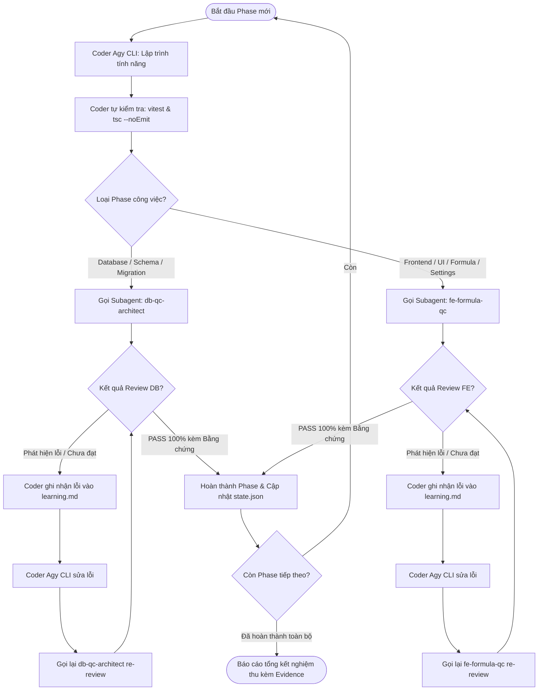

# OPERATING EXECUTION LOOP (LOOP.MD)

Tài liệu quy chuẩn chu trình làm việc khép kín giữa **Coder (Agy CLI)** và các **Subagents QC Độc Lập** (`db-qc-architect` và `fe-formula-qc`), đảm bảo tính kiểm chứng, bài học ghi nhớ (`learning.md`) và kiểm soát chất lượng tuyệt đối trước khi sang Phase mới.

---

## 1. Sơ đồ chu trình khép kín (The Closed Loop Diagram)

---

## 2. Quy tắc giao tiếp & Điều hướng (Routing Rules)

### Quy tắc 1: Coder xong việc gì thì gọi ai?
- **Khi hoàn thành các công việc liên quan Database** (Schema Dexie.js, Migration `v6 -> v7`, Data Types, Store Indexes, DB Tests):
  👉 **BẮT BUỘC gọi Subagent `db-qc-architect`** để kiểm định độc lập.
- **Khi hoàn thành các công việc liên quan Frontend & Formula** (Căn chỉnh CSS chống tràn chữ `EmployeeListPage`, Bảng chấm công `TimesheetCalendarPage`, Menu mới `ProductivityQualityPage`, Cấu hình `SettingsPage`, Công thức `formula-defs` & `formula-engine`):
  👉 **BẮT BUỘC gọi Subagent `fe-formula-qc`** để kiểm định độc lập.

### Quy tắc 2: Khi Subagent phát hiện lỗi thì gọi ai?
1. Subagent KHÔNG tự ý sửa file bừa bãi (đảm bảo không vượt quyền).
2. Subagent lập báo cáo lỗi chi tiết: Tên file, vị trí dòng, bằng chứng lỗi thực tế (log test fail hoặc code vi phạm), giải thích rủi ro.
3. Subagent chuyển giao lại cho **Coder (Agy CLI)**.
4. **Trách nhiệm của Coder khi nhận lỗi**:
   - **BẮT BUỘC** mở file `learning.md` và ghi lại:
     - Ngày giờ & Phase.
     - Triệu chứng lỗi & Nguyên nhân kỹ thuật.
     - Phương án sửa & Cách phòng ngừa tái diễn.
   - Tiến hành sửa lỗi trên mã nguồn.
   - Chạy kiểm tra sơ bộ.
   - **Gọi lại đúng Subagent đó** để Re-Review.

### Quy tắc 3: Khi Subagent xác nhận PASS thì gọi ai?
1. Subagent đưa ra kết luận **PASS** kèm theo bằng chứng cụ thể (kết quả `vitest` pass, `tsc` 0 lỗi, schema/DOM element verified).
2. Coder nhận kết quả PASS, tiến hành cập nhật tiến độ vào `state.json`.
3. Coder bắt đầu Phase tiếp theo (nếu còn), hoặc tổng kết dự án bàn giao cho người dùng.

---

## 3. Phân rã Phase chi tiết cho đợt nâng cấp hiện tại

| Phase | Nội dung công việc | Coder thực hiện | Subagent nghiệm thu | Tiêu chí PASS bắt buộc |
|---|---|---|---|---|
| **Phase A** | Nâng cấp Schema Dexie.js `v7` (`productionLines`, `productivityQualityRates`, fields mới trên `IEmployee`, `ISystemSettings`) | Agy CLI | `db-qc-architect` | Migration an toàn, seed mặc định 2 Line, test DB 100% pass |
| **Phase B** | Cập nhật Formula Engine (`formula-defs.ts`, `formula-engine.ts`): Tách Off & UL, cộng dồn Off+UL cho chuyên cần, tính tiền NS Nhóm 2, đoàn phí động | Agy CLI | `fe-formula-qc` | Unit tests kiểm tra đúng các ca: thử việc=0, nghỉ 2 ngày UL+Off trừ 50%, 3 ngày mất sạch, tính đúng NS Nhóm 2 |
| **Phase C** | Fix CSS tràn chữ `EmployeeListPage.tsx` & Bổ sung chọn Line, Nhóm NS 1/2 | Agy CLI | `fe-formula-qc` | Không rớt chữ trên màn laptop, dropdown hoạt động trơn tru |
| **Phase D** | Nâng cấp UI Bảng chấm công `TimesheetCalendarPage.tsx` (dọn dẹp mã cột AN, AO..., thêm Thai sản, Công tác, Thưởng thêm, tách Off/UL) | Agy CLI | `fe-formula-qc` | Header sạch sẽ, các cột mới hiển thị chuẩn dữ liệu, đoàn phí đọc từ settings |
| **Phase E** | Xây dựng Menu mới `ProductivityQualityPage.tsx` (ma trận ngày, Line Rivet 1 & 2, nút Thêm Line) & Cấu hình Settings | Agy CLI | `fe-formula-qc` | Thêm Line động thành công, nhập % NS & % CL lưu Dexie, Settings cấu hình được Đoàn phí, Chuyên cần, Đơn giá NS |
